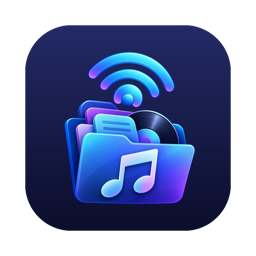

# Streamer



Streamer plays your own music as a radio station. It is a small macOS menubar app that takes a Music playlist, or a folder of audio files, and serves it as a continuous AAC stream at `http://127.0.0.1:8090/stream`.

Anything that can play internet radio can tune in: [blether](https://github.com/ohnotnow/blether)'s background stream, VLC, or Safari on your phone.

## What it does

Pick a source from the menu and press Start. Streamer plays the tracks in order and sends the same audio to everyone who is listening, like radio. When it reaches the end of the source it loops back to the start.

When the last listener goes away it pauses where it was, and the next listener picks up from there.

A source is either:

- a playlist from the Music app, or
- a folder you add with "Add folder...". Folders are searched all the way down. Files play in path order. It plays `mp3`, `m4a` (including ALAC), `aac`, `aiff`, `wav` and `flac` files.

Tracks that cannot play (a missing file, a cloud-only Music track, a DRM-protected purchase) are skipped.

The menubar icon shows a hollow mast when Streamer is off, a mast with one pair of waves when it is serving with nobody listening, and two pairs when someone is listening.

## Prerequisites

- macOS 27 or later
- Xcode, for the Swift 6 toolchain
- [XcodeGen](https://github.com/yonaskolb/XcodeGen) (`brew install xcodegen`)

## Getting started

```sh
git clone https://github.com/ohnotnow/streamer.git
cd streamer
make install
```

`make install` builds Streamer, copies it to `/Applications` and opens it. Look for the mast icon in your menubar. After that you can delete the cloned folder if you like.

If you are working on Streamer, `make run` builds and opens a copy from `build/` instead. Builds are ad-hoc signed, so macOS treats every rebuild as a new app and asks for Music access again. To stop that, create an untracked `local.mk` with `SIGN` (the hash from `security find-identity -v -p codesigning`) and `TEAM`, so every build is signed by the same certificate. The `Makefile` has the details.

## macOS privacy prompts

- The first time Streamer reads your Music library, macOS asks whether it may access Apple Music. If you say no, you can change your mind in System Settings, Privacy & Security, Media & Apple Music. If you are hacking on the app: macOS only shows this prompt when `Info.plist` has `NSAppleMusicUsageDescription`. Without it, access is refused silently and reading the library fails with error 4097.
- Running `make test` from a checkout inside `~/Documents` may ask whether Streamer can access files in your Documents folder.

## Listening

Local listening is the default: Streamer only listens on `127.0.0.1`. To use it with blether, put `http://127.0.0.1:8090/stream` in blether's stream setting.

To listen from another device, turn on "Share on the network" and press Start again (the switch takes effect on the next Start). Streamer then listens on every network interface, including Tailscale if you use it. There is no password, so anyone who can reach your Mac on that network can listen. With sharing on, Copy stream URL gives you your Mac's local network name, such as `http://your-mac.local:8090/stream`. Over Tailscale, use your Mac's Tailscale name in its place.

"Keep Mac awake while listening" is on by default. While someone is listening, it stops your Mac going to sleep when idle. The display can still sleep, and a laptop still sleeps when you close the lid.

Music playlists are read when Streamer starts, so quit and reopen it after making a new playlist.

To watch what Streamer is doing while it runs:

```sh
log stream --predicate 'subsystem == "uk.ohnotnow.streamer"'
```

## Running tests

```sh
make test
```

## Contributing

Fork or clone the repo, run `make test`, and hack away. Under `Sources/Streamer`, `Audio` holds the decoder, encoder, ADTS framing and broadcaster, `Server` holds the HTTP server, and `Sources` holds the Music and folder sources. `spike/` has the original single-file proof of concept, kept as a reference.

## Licence

MIT. See [LICENSE](LICENSE).
